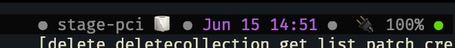
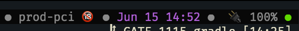

# k8s-ctx

A tmux widget to display the current Kubernetes context




### Usage with tpm

Add to *tmux.conf*
```
# add plugin
set -g @plugin '0x0BSoD/k8s-ctx'

# configuration
set -g @k8s_ctx_envs "stage,prod,okd"
set -g @k8s_ctx_icons "🧻,🔞,🧰"

# adding to status bar
set -g status-right "#{k8s_ctx}"
```